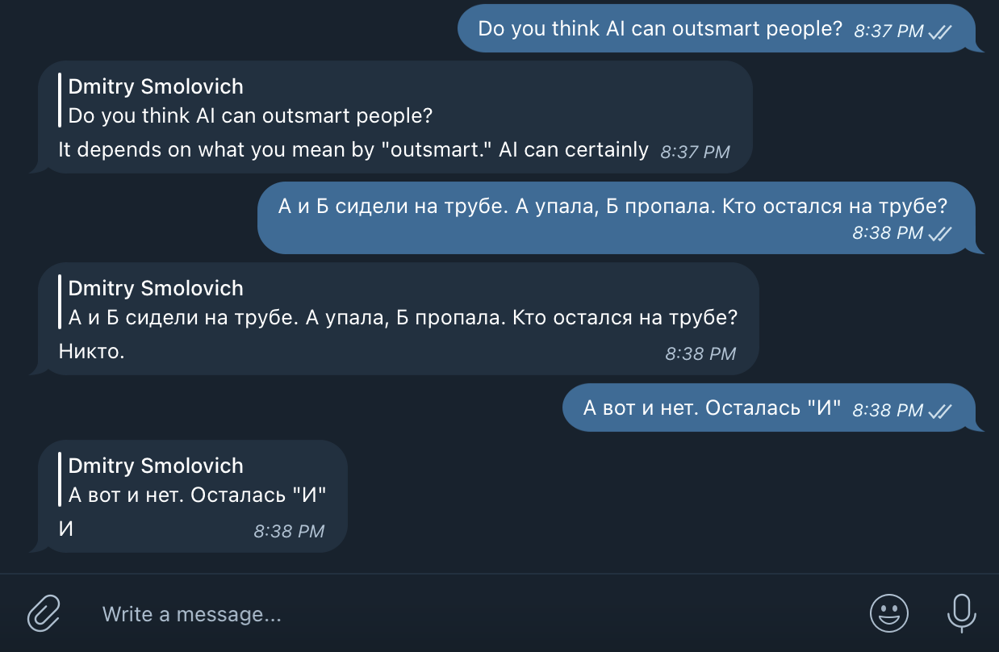

# OpenAI on Telegram
## Pre-requisites:
- [Docker](https://www.docker.com/)
- [docker-compose plugin](https://docs.docker.com/compose/install/linux/)
- Telegram API key (request it from [Bot Father](https://telegram.me/BotFather) when creating a new bot)
- API key from [OpenAI](https://openai.com/api/) 

## Build and run:
```python
cp .env.sample .env
# Enter your API keys to .env file
docker-compose build
docker-compose up -d
```

## Talk to AI
Start conversation with your bot, it's smart enough.



[](https://www.youtube.com/watch?v=taMFFY0s8zg)